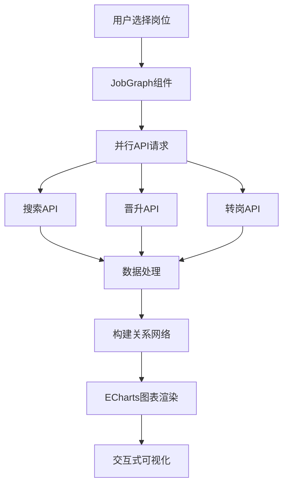

# 前端知识图谱技术解析文档

## 📋 文档概述

本文档详细解析了基于AI的大学生职业规划智能体项目中的前端知识图谱系统。该系统通过先进的可视化技术，将复杂的职业关系网络以直观的方式呈现，为用户提供清晰的职业发展路径参考。

## 🏗️ 系统架构概览

### 技术栈组成

| 层级 | 技术栈 | 主要功能 |
|------|--------|----------|
| 前端框架 | Vue 3 + TypeScript | 组件化开发、类型安全 |
| 图表库 | ECharts 5 | 专业级数据可视化 |
| 样式 | CSS3 + Element Plus | 响应式UI设计 |
| 数据请求 | Fetch API | RESTful API调用 |
| 状态管理 | Pinia | 全局状态管理 |

### 核心组件架构

```
前端知识图谱系统
├── JobGraph.vue (岗位关联图谱组件)
├── AbilityRadar.vue (能力评估组件)
├── MatchResult.vue (匹配结果组件)
└── 可视化图表库
    ├── 雷达图 (多维度能力评估)
    ├── 力导向图 (关系网络)
    ├── 柱状图 (数据分布)
    └── 进度条 (技能掌握度)
```

## 🔗 核心组件详细解析

### 1. JobGraph.vue - 岗位关联图谱组件

#### 文件位置
`前端/vue-A13/src/components/job/JobGraph.vue`

#### 主要功能
- **岗位关系可视化**：展示当前岗位与其他岗位的关联关系
- **发展路径分析**：显示晋升路径和横向转岗路径
- **交互式探索**：支持缩放、拖拽、悬停查看详情

#### 技术实现

##### 数据结构定义
```typescript
interface Job {
  id: string
  title: string
  company: string
  industry: string
  location: string
  salary: string
  salaryMin: number
  salaryMax: number
  experience: string
  education: string
  description: string
  requirements: string[]
  tags: string[]
  isFavorite: boolean
  publishDate: string
}

type Relationship = 'PROMOTES_TO' | 'TRANSFERS_TO' | 'RELATED_TO'
```

##### 数据获取流程
```typescript
const fetchGraphData = async (job: Job) => {
  try {
    // 并行请求三种关系数据
    const searchResponse = await fetch(`/neo4j/jobs/search?keyword=${job.title}&limit=10`)
    const promotionResponse = await fetch(`/neo4j/jobs/${job.title}/promotions`)
    const transferResponse = await fetch(`/neo4j/jobs/${job.title}/transfers`)
    
    const [searchData, promotionData, transferData] = await Promise.all([
      searchResponse.json(),
      promotionResponse.json(),
      transferResponse.json()
    ])
    
    // 构建节点和边的关系网络
    const nodes = new Set<string>()
    const links: { source: string; target: string; type: string }[] = []
    
    // 处理搜索结果
    if (Array.isArray(searchData)) {
      searchData.forEach(item => {
        if (item.name) {
          nodes.add(item.name)
          links.push({ source: job.title, target: item.name, type: 'RELATED_TO' })
        }
      })
    }
    
    // 处理晋升路径
    if (Array.isArray(promotionData)) {
      promotionData.forEach(item => {
        if (item.name) {
          nodes.add(item.name)
          links.push({ source: job.title, target: item.name, type: 'PROMOTES_TO' })
        }
      })
    }
    
    // 处理转岗路径
    if (Array.isArray(transferData)) {
      transferData.forEach(item => {
        if (item.name) {
          nodes.add(item.name)
          links.push({ source: job.title, target: item.name, type: 'TRANSFERS_TO' })
        }
      })
    }
    
    nodes.add(job.title)
    return { nodes: Array.from(nodes), links }
  } catch (error) {
    console.error('获取知识图谱数据失败:', error)
    return generateMockGraphData(job.title)
  }
}
```

##### ECharts图表配置
```typescript
const option = {
  title: {
    text: `${job.title} - 发展路径`,
    left: 'center',
    textStyle: { fontSize: 14, fontWeight: 'bold', color: '#333' }
  },
  tooltip: { trigger: 'item', formatter: '{b}' },
  animation: true,
  animationDurationUpdate: 1500,
  series: [{
    type: 'graph',
    layout: 'force',
    force: {
      repulsion: 1000,    // 节点斥力
      edgeLength: [100, 200], // 边长度范围
      gravity: 0.1,       // 重力系数
      friction: 0.2       // 摩擦力
    },
    roam: true,          // 支持缩放拖拽
    label: { 
      show: true, 
      position: 'right', 
      formatter: '{b}', 
      fontSize: 12, 
      color: '#333' 
    },
    data: graphData.nodes.map((node, index) => ({
      name: node,
      itemStyle: {
        color: node === job.title ? '#667eea' : 
               ['#764ba2', '#f093fb', '#f5576c', '#4facfe', '#43e97b'][index % 5]
      },
      symbolSize: node === job.title ? 60 : 45 + Math.random() * 15,
      label: node === job.title ? { fontWeight: 'bold' } : {}
    })),
    links: graphData.links.map(link => ({
      source: link.source,
      target: link.target,
      label: { show: true, formatter: link.type, fontSize: 10, color: '#999' },
      lineStyle: {
        color: getLinkColor(link.type),
        curveness: 0.3,
        width: 2
      }
    }))
  }]
}
```

##### 关系类型颜色映射
```typescript
const getLinkColor = (type: string) => {
  switch (type) {
    case 'PROMOTES_TO': return '#43e97b' // 晋升关系 - 绿色
    case 'TRANSFERS_TO': return '#4facfe' // 转岗关系 - 蓝色  
    case 'RELATED_TO': return '#f5576c'   // 相关关系 - 红色
    default: return '#999'
  }
}
```

### 2. AbilityRadar.vue - 能力评估组件

#### 文件位置
`前端/vue-A13/src/components/student/AbilityRadar.vue`

#### 主要功能
- **多维度能力评估**：通过雷达图展示各项能力评分
- **技能掌握进度**：使用进度条显示技能掌握程度
- **数据可视化**：多种图表类型展示分析结果

#### 数据结构
```typescript
// 能力评估数据结构
interface AbilityAssessment {
  [key: string]: {
    score: number
    description: string
  }
}

// 技能匹配数据结构
interface SkillMatch {
  技能: string
  匹配度: number
  重要性: '高' | '中' | '低'
}

// 进度数据
interface ProgressData {
  name: string
  progress: number
}
```

#### 图表类型
1. **雷达图** - 多维度能力对比
2. **柱状图** - 能力分布展示  
3. **进度条** - 技能掌握程度
4. **评分卡片** - 具体能力评分

## 🌐 API接口集成

### 后端API接口

| 接口名称 | 请求方式 | 路径 | 功能描述 |
|----------|----------|------|----------|
| 岗位搜索 | GET | `/neo4j/jobs/search?keyword={keyword}&limit=10` | 搜索相关岗位 |
| 晋升路径 | GET | `/neo4j/jobs/{title}/promotions` | 获取晋升路径 |
| 转岗路径 | GET | `/neo4j/jobs/{title}/transfers` | 获取转岗路径 |

### 数据流设计



## 🎨 可视化技术特点

### 1. 智能数据关联
- **自动发现关系**：基于Neo4j图数据库自动发现岗位间的关系
- **多维度关联**：支持晋升、转岗、相关三种关系类型
- **实时数据更新**：数据变化时自动刷新图表

### 2. 交互式体验
- **拖拽缩放**：支持图表自由缩放和拖拽查看
- **悬停提示**：鼠标悬停显示详细信息
- **动态布局**：力导向布局自动优化节点位置

### 3. 可视化效果
- **颜色编码**：不同关系类型使用不同颜色标识
- **大小区分**：中心节点更大，关联节点较小
- **动画效果**：节点移动和布局变化有平滑动画

### 4. 响应式设计
```css
.graph-container {
  width: 100%;
  height: 350px;
  min-height: 350px;
  border-radius: 8px;
  overflow: hidden;
  background: #f9f9f9;
  border: 1px solid #e2e8f0;
}

@media (max-width: 768px) {
  .graph-container {
    height: 300px;
    min-height: 300px;
  }
}
```

## 🔧 组件生命周期管理

### 挂载和卸载处理
```typescript
onMounted(() => {
  if (props.job) {
    nextTick(() => {
      setTimeout(() => renderChart(), 500)
    })
  }
})

onUnmounted(() => {
  chart?.dispose() // 清理图表实例
})
```

### 数据监听机制
```typescript
watch(() => props.job, (newJob) => {
  if (newJob) {
    nextTick(() => {
      setTimeout(() => renderChart(), 500)
    })
  }
})
```

## 🚀 性能优化策略

### 1. 图表实例管理
- **实例复用**：避免重复创建图表实例
- **内存清理**：组件卸载时正确释放资源
- **延迟渲染**：使用setTimeout确保DOM就绪

### 2. 数据加载优化
- **并行请求**：同时请求多种关系数据
- **错误降级**：API失败时使用模拟数据
- **缓存机制**：相同数据避免重复请求

### 3. 渲染性能
- **虚拟DOM**：Vue的响应式系统优化渲染
- **图表优化**：ECharts的性能优化配置
- **懒加载**：按需加载图表组件

## 💡 设计亮点

### 1. 模块化设计
- **组件职责单一**：每个组件专注于特定功能
- **数据流清晰**：props驱动，状态管理规范
- **样式与逻辑分离**：CSS模块化，逻辑封装

### 2. 用户体验优化
- **加载状态提示**：数据加载时显示友好提示
- **错误降级处理**：API失败时优雅降级
- **响应式适配**：多设备兼容性

### 3. 可扩展性设计
- **关系类型扩展**：易于添加新的关系类型
- **图表类型扩展**：支持新的可视化需求
- **API接口扩展**：模块化API设计

## 🔄 错误处理机制

### 数据获取错误处理
```typescript
const fetchGraphData = async (job: Job) => {
  try {
    // 正常数据获取流程
    return await fetchRealData(job)
  } catch (error) {
    console.error('获取知识图谱数据失败:', error)
    // 降级到模拟数据
    return generateMockGraphData(job.title)
  }
}

const generateMockGraphData = (title: string) => {
  const relatedJobs = ['高级工程师', '技术专家', '架构师', '技术总监']
  const relationships = ['PROMOTES_TO', 'RELATED_TO', 'PROMOTES_TO', 'PROMOTES_TO']
  
  const nodes = new Set<string>()
  const links: { source: string; target: string; type: string }[] = []
  
  nodes.add(title)
  relatedJobs.forEach((job, index) => {
    nodes.add(job)
    links.push({
      source: title,
      target: job,
      type: relationships[index] || 'RELATED_TO'
    })
  })
  
  return { nodes: Array.from(nodes), links }
}
```

### 图表渲染错误处理
```typescript
const renderChart = async () => {
  if (!graphRef.value || !props.job) {
    return
  }

  try {
    if (chart) {
      chart.dispose()
      chart = null
    }

    chart = echarts.init(graphRef.value)
    const graphData = await fetchGraphData(props.job)
    
    // 图表配置和渲染
    chart.setOption(option)
    
    // 延迟重设大小确保渲染正确
    setTimeout(() => chart?.resize(), 100)
    setTimeout(() => chart?.resize(), 300)
    setTimeout(() => chart?.resize(), 500)
  } catch (error) {
    console.error('图表渲染失败:', error)
  }
}
```

## 📊 应用场景分析

### 1. 职业规划场景
- **岗位探索**：帮助用户了解相关岗位和发展路径
- **能力评估**：可视化展示个人能力与岗位要求的匹配度
- **发展建议**：基于数据分析提供个性化职业发展建议

### 2. 教育指导场景
- **技能培养**：明确需要提升的技能方向
- **学习路径**：规划合理的学习和发展路径
- **就业指导**：提供针对性的就业建议

### 3. 企业招聘场景
- **人才匹配**：智能匹配岗位需求和人才能力
- **职业发展**：为员工提供清晰的职业发展路径
- **技能评估**：评估员工技能与岗位要求的匹配度

## 🔮 未来扩展方向

### 1. 功能扩展
- **更多关系类型**：添加技能关联、行业关联等关系
- **时间轴视图**：展示职业发展的历史轨迹
- **预测分析**：基于历史数据的职业发展预测

### 2. 技术优化
- **3D可视化**：引入3D图表增强视觉效果
- **实时数据**：支持实时数据更新和推送
- **AI增强**：集成更多AI分析能力

### 3. 用户体验
- **个性化定制**：支持用户自定义图表样式
- **多语言支持**：国际化多语言界面
- **无障碍访问**：提升可访问性支持

## 📝 总结

前端知识图谱系统通过先进的可视化技术，将复杂的职业关系网络以直观的方式呈现，为用户提供了清晰的职业发展路径参考。系统采用模块化设计，具有良好的可扩展性和维护性，同时通过完善的错误处理机制确保了系统的稳定性。

该系统的成功实施不仅提升了用户体验，也为职业规划领域的数据可视化提供了优秀的技术实践案例。随着技术的不断发展，该系统还有很大的优化和扩展空间，有望在职业规划、教育指导、企业招聘等领域发挥更大的价值。